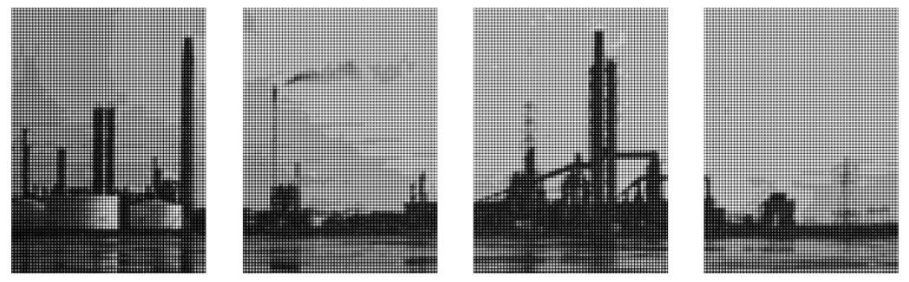

# image-edit

A couple of basic image manipulation tasks using the Python PIL library:

- [Make-collage-from-images.ipynb](Make-collage-from-images.ipynb) - combines multiple images into a tiled collage
- [Make-tiled-halftone-images.ipynb](Make-tiled-halftone-images.ipynb) - splits an image into a grid of tiles and applies half-toning using the [python-halftone](https://github.com/philgyford/python-halftone) module by Phil Gyford.

## Example

Input image:

Output:

